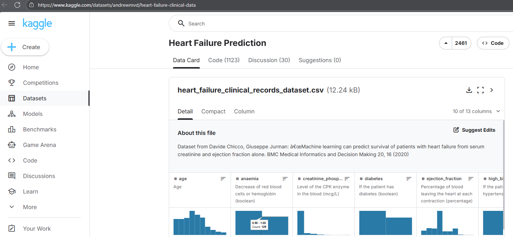
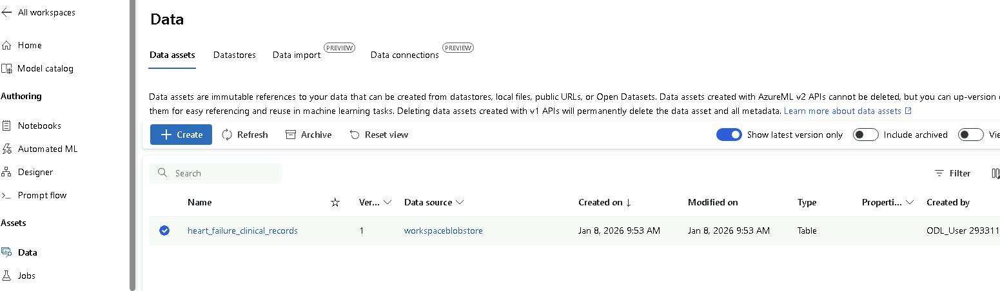

# Capstone Project - Azure Machine Learning Engineer

## Project Overview

This project focuses on predicting mortality caused by heart failure using clinical patient data. The objective is to build and evaluate machine learning models that can accurately estimate the risk of death based on medical attributes such as age, ejection fraction, serum creatinine, blood pressure, and diabetes. The dataset used in this project is the Heart Failure Clinical Records Dataset, obtained from Kaggle (https://www.kaggle.com/datasets/andrewmvd/heart-failure-clinical-data), and uploaded to Azure Machine Learning Studio for experimentation.

Two different modeling approaches are implemented in this project. First, an Automated Machine Learning (AutoML) experiment is used to automatically explore multiple algorithms and preprocessing techniques in order to identify a high-performing classification model. Second, a custom machine learning model is trained, and its hyperparameters are optimized using HyperDrive to systematically search for the best parameter configuration. The performance of both models is evaluated and compared using appropriate classification metrics.

After model evaluation, the best-performing model is registered and deployed as a REST endpoint in Azure Machine Learning. This allows the model to be accessed for real-time inference through HTTP requests.

## Project Justification

Heart failure is a critical medical condition with high mortality rates, making early risk assessment essential for improving patient outcomes. Clinical decision-making often requires analyzing multiple health indicators simultaneously, which can be challenging and time-sensitive. Machine learning techniques provide an opportunity to support clinicians by identifying patterns in clinical data and estimating mortality risk more effectively.

By applying both AutoML and HyperDrive-based model optimization, this project evaluates different modeling strategies and highlights their effectiveness in a healthcare prediction scenario.

## Objectives

- Develop a machine learning model to predict mortality caused by heart failure.
- Train and evaluate two models: one using Azure AutoML and one using HyperDrive for hyperparameter tuning.
- Compare the performance of AutoML and HyperDrive-based models using suitable evaluation metrics.
- Register and deploy the best-performing model as a REST endpoint.
- Demonstrate how the deployed model can be consumed via an HTTP inference request.

## Dataset

### Overview
The dataset used in this project is the Heart Failure Clinical Records Dataset, obtained from Kaggle (https://www.kaggle.com/datasets/andrewmvd/heart-failure-clinical-data).
The file "heart_failure_clinical_records_dataset.csv" contains clinical records of 299 patients who experienced heart failure.

### Task
The task addressed in this project is a binary classification problem: predicting whether a patient will experience mortality due to heart failure. The target variable is DEATH_EVENT, where:
- 1 indicates that the patient died during the follow-up period
- 0 indicates survival

The input features used for model training include clinical and demographic attributes such as:
- age : Age.
- anaemia : Decrease of red blood cells or hemoglobin (boolean).
- creatinine_phosphokinase : Level of the CPK enzyme in the blood (mcg/L).
- diabetes : If the patient has diabetes (boolean).
- ejection_fraction : Percentage of blood leaving the heart at each contraction (percentage).
- high_blood_pressure : If the patient has hypertension (boolean).
- platelets : Platelets in the blood (kiloplatelets/mL).
- serum_creatinine : Level of serum creatinine in the blood (mg/dL).
- serum_sodium : Level of serum sodium in the blood (mEq/L).
- sex : Woman or man (binary).
- smoking : If the patient smokes or not (boolean).
- time : Follow-up period (days).
- DEATH_EVENT : If the patient deceased during the follow-up period (boolean).

### Access
The dataset is firstly downloaded from https://www.kaggle.com/datasets/andrewmvd/heart-failure-clinical-data, then uploaded locally to Azure ML Workspace, and then used directly in the experiments.



Registering dataset in Azure ML Studio:



## Automated ML
Give an overview of the `automl` settings and configuration you used for this experiment

```python
# automl settings
automl_settings = {
    "experiment_timeout_minutes": 20,
    "max_concurrent_iterations": 5,
    "primary_metric" : 'AUC_weighted'
}

# automl config
automl_config = AutoMLConfig(compute_target=compute_target,
                             task = "classification",
                             training_data=dataset,
                             label_column_name="DEATH_EVENT",   
                             path = project_folder,
                             enable_early_stopping= True,
                             featurization= 'auto',
                             debug_log = "automl_errors.log",
                             **automl_settings
                            )
```
### Results
What were the parameters of the model?
The best performing model is the VotingEnsemble with an AUC_weighted value of 0.89

- Since the AutoML run used automatic featurization (featurization='auto'), model performance could be improved by applying domain-specific feature transformations before training, allowing AutoML to start from more informative input features.
- With an experiment timeout of only 20 minutes (experiment_timeout_minutes=20) and a limited number of concurrent iterations, increasing the time budget would allow AutoML to evaluate more algorithms and hyperparameter combinations, potentially leading to a stronger VotingEnsemble.
- Enabling cross-validation and training the AutoML model on a larger or more diverse dataset would help improve generalization performance and reduce the risk of overfitting, especially when optimizing for AUC_weighted.

Screenshots of the `RunDetails` widget as well as a screenshot of the best model trained with it's parameters.

## Hyperparameter Tuning
*TODO*: What kind of model did you choose for this experiment and why? Give an overview of the types of parameters and their ranges used for the hyperparameter search


### Results
*TODO*: What are the results you got with your model? What were the parameters of the model? How could you have improved it?

*TODO* Remeber to provide screenshots of the `RunDetails` widget as well as a screenshot of the best model trained with it's parameters.

## Model Deployment
*TODO*: Give an overview of the deployed model and instructions on how to query the endpoint with a sample input.

## Screen Recording
Due to company policy restrictions, screen recording is not permitted in the working environment.
Therefore, a screen recording of the project execution cannot be provided.

The project functionality and workflow are instead demonstrated through detailed screenshots and step-by-step explanations throughout this README.

## Standout Suggestions
*TODO (Optional):* This is where you can provide information about any standout suggestions that you have attempted.
