# Capstone Project - Azure Machine Learning Engineer

## Project Overview

This project focuses on predicting mortality caused by heart failure using clinical patient data. The objective is to build and evaluate machine learning models that can accurately estimate the risk of death based on medical attributes such as age, ejection fraction, serum creatinine, blood pressure, and diabetes. The dataset used in this project is the Heart Failure Clinical Records Dataset, obtained from Kaggle (https://www.kaggle.com/datasets/andrewmvd/heart-failure-clinical-data), and uploaded to Azure Machine Learning Studio for experimentation.

Two different modeling approaches are implemented in this project. First, an Automated Machine Learning (AutoML) experiment is used to automatically explore multiple algorithms and preprocessing techniques in order to identify a high-performing classification model. Second, a custom machine learning model is trained, and its hyperparameters are optimized using HyperDrive to systematically search for the best parameter configuration. The performance of both models is evaluated and compared using appropriate classification metrics.

After model evaluation, the best-performing model is registered and deployed as a REST endpoint in Azure Machine Learning. This allows the model to be accessed for real-time inference through HTTP requests.

## Project Justification

Heart failure is a critical medical condition with high mortality rates, making early risk assessment essential for improving patient outcomes. Clinical decision-making often requires analyzing multiple health indicators simultaneously, which can be challenging and time-sensitive. Machine learning techniques provide an opportunity to support clinicians by identifying patterns in clinical data and estimating mortality risk more effectively.

By applying both AutoML and HyperDrive-based model optimization, this project evaluates different modeling strategies and highlights their effectiveness in a healthcare prediction scenario.

## Objectives

- Develop a machine learning model to predict mortality caused by heart failure.
- Train and evaluate two models: one using Azure AutoML and one using HyperDrive for hyperparameter tuning.
- Compare the performance of AutoML and HyperDrive-based models using suitable evaluation metrics.
- Register and deploy the best-performing model as a REST endpoint.
- Demonstrate how the deployed model can be consumed via an HTTP inference request.

## Dataset

### Overview
The dataset used in this project is the Heart Failure Clinical Records Dataset, obtained from Kaggle (https://www.kaggle.com/datasets/andrewmvd/heart-failure-clinical-data).
The file "heart_failure_clinical_records_dataset.csv" contains clinical records of 299 patients who experienced heart failure.

### Task
The task addressed in this project is a binary classification problem: predicting whether a patient will experience mortality due to heart failure. The target variable is DEATH_EVENT, where:
- 1 indicates that the patient died during the follow-up period
- 0 indicates survival

The input features used for model training include clinical and demographic attributes such as:
- age : Age.
- anaemia : Decrease of red blood cells or hemoglobin (boolean).
- creatinine_phosphokinase : Level of the CPK enzyme in the blood (mcg/L).
- diabetes : If the patient has diabetes (boolean).
- ejection_fraction : Percentage of blood leaving the heart at each contraction (percentage).
- high_blood_pressure : If the patient has hypertension (boolean).
- platelets : Platelets in the blood (kiloplatelets/mL).
- serum_creatinine : Level of serum creatinine in the blood (mg/dL).
- serum_sodium : Level of serum sodium in the blood (mEq/L).
- sex : Woman or man (binary).
- smoking : If the patient smokes or not (boolean).
- time : Follow-up period (days).
- DEATH_EVENT : If the patient deceased during the follow-up period (boolean).

### Access
The dataset is firstly downloaded from https://www.kaggle.com/datasets/andrewmvd/heart-failure-clinical-data, then uploaded locally to Azure ML Workspace, and then used directly in the experiments.


Registering dataset in Azure ML Studio:

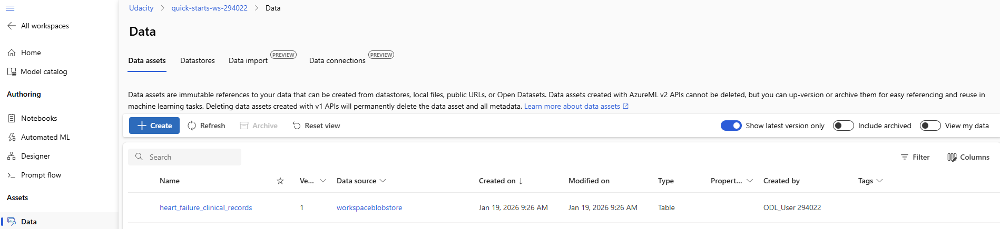

## Automated ML
Give an overview of the `automl` settings and configuration you used for this experiment

```python
# automl settings
automl_settings = {
    "experiment_timeout_minutes": 15,
    "max_concurrent_iterations": 5,
    "primary_metric" : 'accuracy'
}

# automl config
automl_config = AutoMLConfig(compute_target=compute_target,
                             task = "classification",
                             training_data=dataset,
                             label_column_name="DEATH_EVENT",   
                             path = project_folder,
                             enable_early_stopping= True,
                             featurization= 'auto',
                             debug_log = "automl_errors.log",
                             **automl_settings
                            )
```
### Results
#### Completed AutoML Job

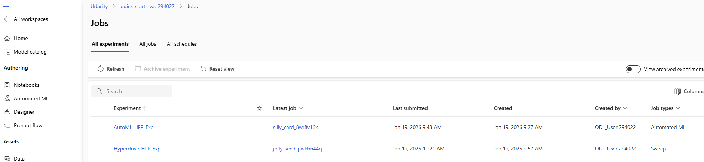

#### Best Model
The best performing model is the VotingEnsemble with an Accuracy value of 0.87954

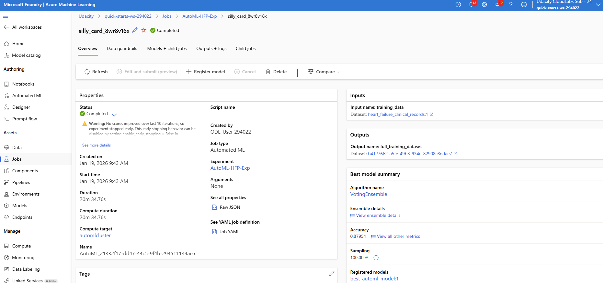

Ranking of the models:

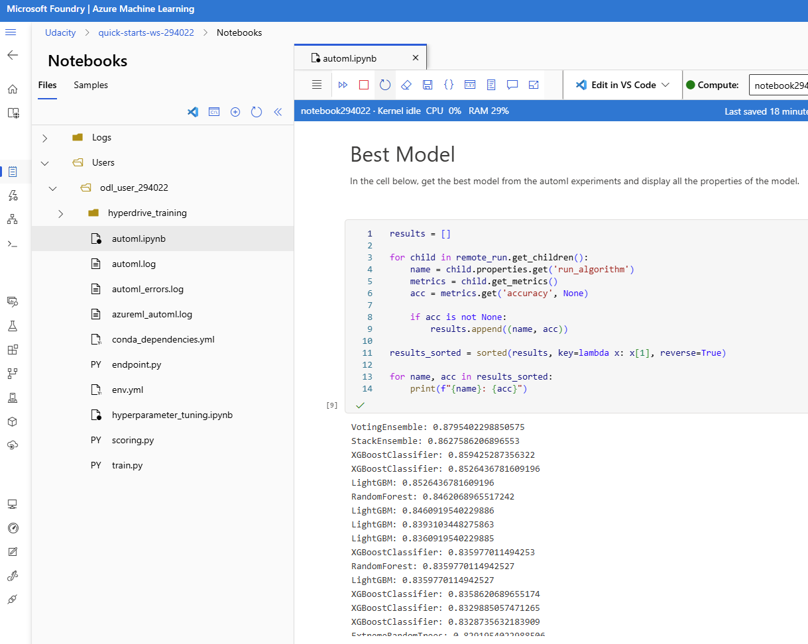

#### Screenshots of the RunDetails

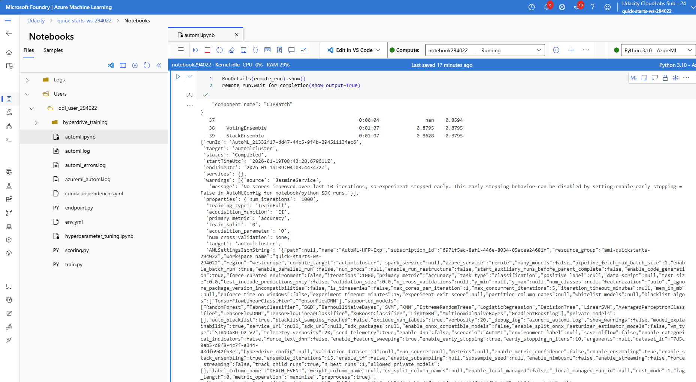

#### Improvements
To improve the results, the following actions can be applied:
- Increasing the experiment timeout of only 15 minutes would allow AutoML to evaluate more algorithms and hyperparameter combinations, potentially leading to a stronger VotingEnsemble.
- Training the AutoML model on a larger or more diverse dataset would help improve generalization performance and reduce the risk of overfitting, especially when optimizing for accuracy.

## Hyperparameter Tuning
For this experiment, a Logistic Regression model was selected as the baseline classifier.

The main reasons for choosing Logistic Regression were:
- The task is a binary classification problem (DEATH_EVENT: 0 or 1), which Logistic Regression is naturally designed for.
- The dataset is small to medium sized, so a linear model can be trained efficiently and reliably.

Hyperparameter tuning was performed using Azure ML HyperDrive with RandomParameterSampling.
Two key hyperparameters of Logistic Regression were optimized:
| Hyperparameter | Meaning                                                                                                      | Search Range |
| -------------- | ------------------------------------------------------------------------------------------------------------ | ------------ |
| **C**          | Inverse of regularization strength (controls model complexity). Smaller values mean stronger regularization. | {0.1, 1}     |
| **max_iter**   | Maximum number of iterations for the optimizer to converge.                                                  | {10, 20, 50} |

```python
param_sampling = RandomParameterSampling(
    {
        '--C' : choice(0.1,1),
        '--max_iter': choice(10,20,50)
    }
)
```

The HyperDrive experiment was configured with the following settings:

- Sampling method: Random search
- Primary metric: Accuracy (maximized)
- Early stopping policy: BanditPolicy
- evaluation interval = 2
- slack factor = 0.2
- Maximum total runs: 6
- Maximum concurrent runs: 4

The BanditPolicy stops poorly performing runs early if their performance is significantly worse than the best run, which saves compute time and speeds up the search.

### Results
#### Completed Hyperdrive Job


#### Best Model
The HyperDrive experiment identified the following best-performing run:
- Best Run ID: HD_aff7f06a-bfb4-4421-b7e5-e3204608ea83_2
- Best Accuracy: 0.7667 (76.67%)

This means that the trained Logistic Regression model correctly classified approximately 77% of the patients in the dataset.

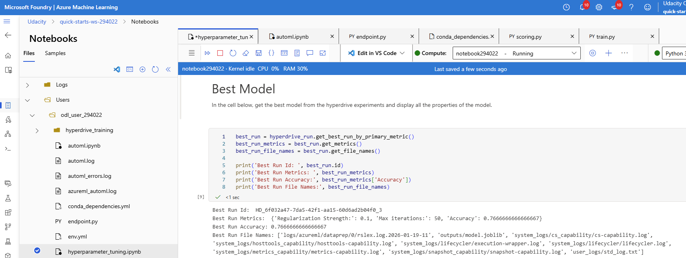

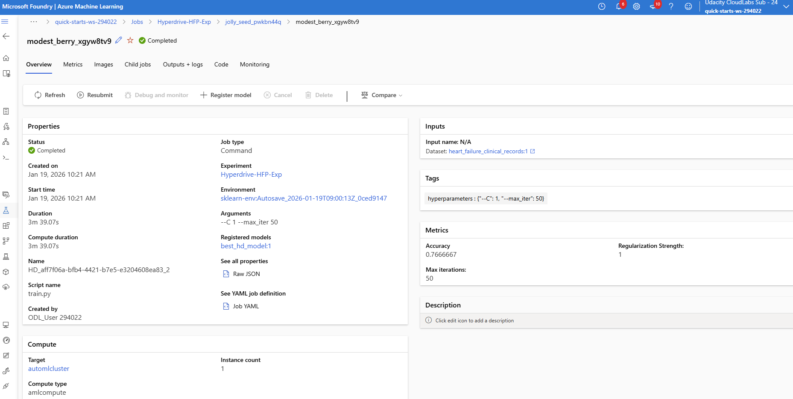

Best model parameters:

| Hyperparameter | Value | Interpretation                                                                        |
| -------------- | ----- | ------------------------------------------------------------------------------------- |
| **C**          | 1.0   | Moderate regularization (allows the model to fit the data more flexibly than C = 0.1) |
| **max_iter**   | 50    | Enough iterations for the optimizer to converge                                       |

With these parameters, the model achieved the highest validation accuracy among all HyperDrive runs.

#### Screenshots of the RunDetails


#### Improvements
The model performance could be improved in a few practical ways:

First, only 6 HyperDrive runs were executed in this experiment. This strongly limits the exploration of the hyperparameter space. Increasing the total number of runs would allow HyperDrive to test more parameter combinations and increase the chance of finding a better-performing model.

Second, the hyperparameter search space was very small. Only two values of C and three values of max_iter were tested. Expanding these ranges would give the optimization process more flexibility.

Finally, accuracy was used as the optimization metric. Since the dataset is imbalanced, using AUC instead of accuracy could lead to a more meaningful and better-generalizing model.

## Model Deployment
Based on the experiment results, the models trained with HyperDrive did not achieve competitive performance compared to the models produced by AutoML. AutoML evaluated a broader range of algorithms and preprocessing pipelines and consistently delivered higher-performing models. For this reason, the model selected for deployment was taken from the AutoML best run. The best-performing model was generated using a VotingEnsemble algorithm, which combines the predictions of multiple individual models to achieve better generalization and robustness.

The VotingEnsemble model was deployed as an Azure Machine Learning web service, allowing it to be consumed via a REST API. This enables external applications to send patient data to the endpoint and receive real-time predictions for heart failure risk.

### Register the models
Both models were registered as shown below:
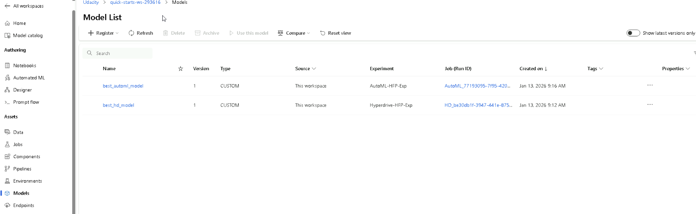

### Deployment of AutoML model with best accuracy metric
The model is successfully deployed with the following script.

```python
best_automl_run.download_file('outputs/conda_env_v_1_0_0.yml', 'env.yml')
environment = best_automl_run.get_environment()
entry_script='scoring.py'

inference_config = InferenceConfig(entry_script = entry_script, environment = environment)

deployment_config = AciWebservice.deploy_configuration(cpu_cores = 1, 
                                                    memory_gb = 1, 
                                                    auth_enabled= True, 
                                                    enable_app_insights= True)

service = Model.deploy(ws, "bestmodeldeployv5", [best_automl_model], inference_config, deployment_config)
service.wait_for_deployment(show_output = True)
```
This code snippet demonstrates how to deploy the best model from an Azure Automated ML (AutoML) run as a real-time web service using Azure Container Instances (ACI). 
Here is a step-by-step breakdown of what each part does:
- InferenceConfig: This defines the "how" of the deployment. It points to the entry_script (scoring.py), which contains the logic to load the model and process incoming data, and the environment which contains the necessary Python libraries.
- AciWebservice.deploy_configuration: This specifies the "where" and the hardware resources. Here, it allocates 1 CPU core and 1 GB of RAM. It also enables Authentication (requiring a key to access the API) and App Insights for monitoring and logging the service's performance.
- Model.deploy: This is the execution step. It takes the Workspace (ws), a unique deployment name (bestmodeldeployv5), the best AutoML model object, and the configurations defined above to trigger the creation of the web service.
- service.wait_for_deployment: This command pauses the script and displays progress logs until the deployment is finished. Once complete, it provides a REST API endpoint that you can use to get real-time predictions. 

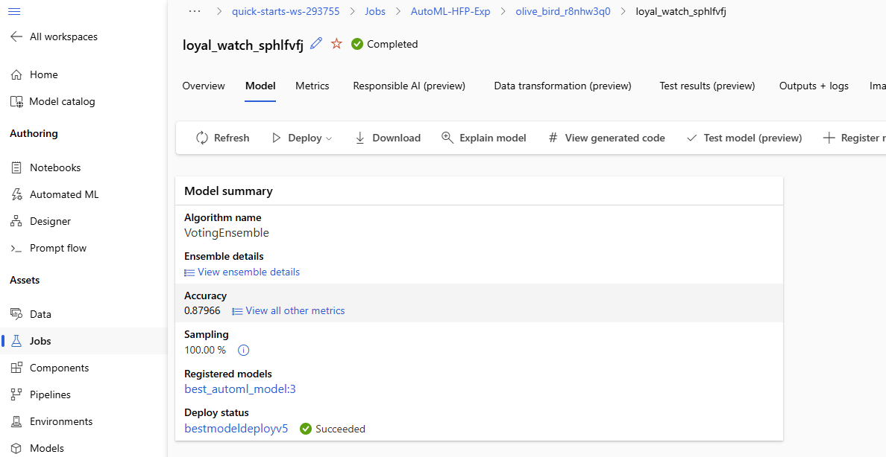

The endpoints which are created after deployment:

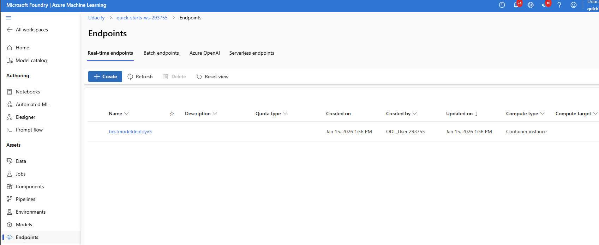

The successsful operation state of the endpoint:

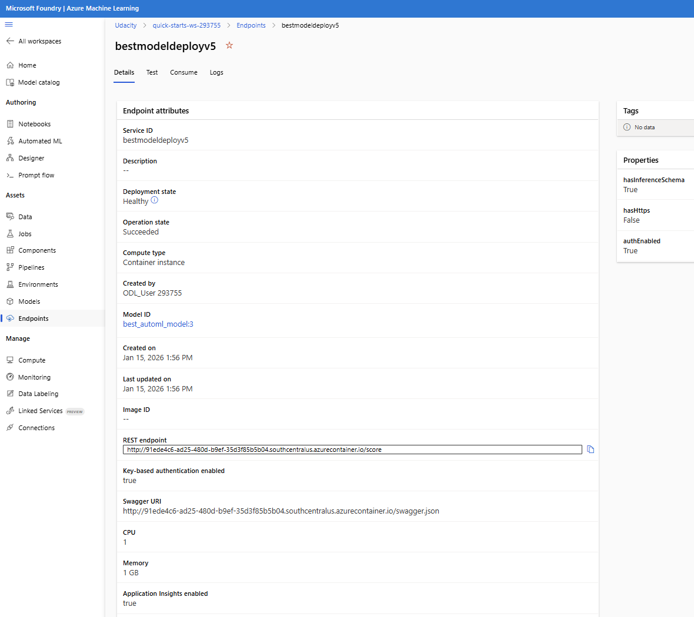

### Consuming endpoint
endpoints.py file is prepared to test our webservice with 2 set of patient data:

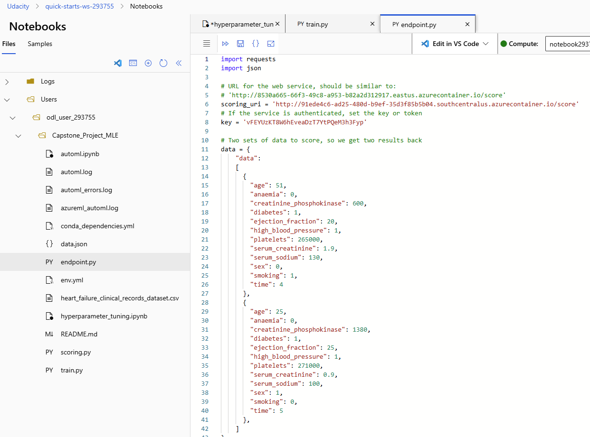

Score uri and authentication key are copied to paste it in the endpoint.py file.

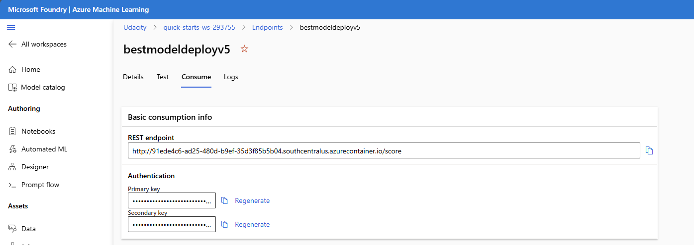

### Results
the results of the model can be seen below:

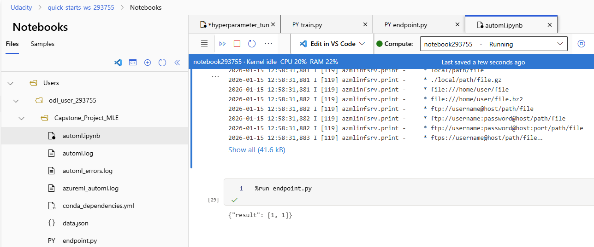

## Screen Recording
Due to company policy restrictions, screen recording is not permitted in the working environment.
Therefore, a screen recording of the project execution cannot be provided.

The project functionality and workflow are instead demonstrated through detailed screenshots and step-by-step explanations throughout this README.
